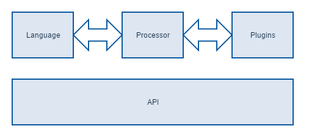

## Components of Xill



At the core of Xill is a modular framework with modules that have clear responsibilities. 

### Language

The language module defines the Xill syntax converts scripts to token trees. These trees contain all tokens required for processing. This module does no processing other than syntax and sanity checking of the scripts.

### Processor

The processor module is where the magic happens. This module executes scripts. It will take a syntax tree and parse it to a processable object. It manages all resources and handles errors and debugging.

### API

The API contains all shared classes. This module provide a shared interface for plugins to talk to. It contains essential classes like the [`MetaExpression`](#metaexpression) and all the shared data types like XML, Date and more.

### Plugins

Now this is what this guide is about. The plugins add actual functionality to Xill. They allow calls to other Java libraries or perform specific operations. These plugins consist of a collection of *constructs* available to the Xill programmer.

A construct in Xill is a function that takes a fixed amount of expressions as input and performs a specific operation. All these constructs can communicate with each other in their own sandbox inside the plugin package. This means the will not affect *constructs* in other plugins.

> **Note:** For the more experienced Java developers, when we talk about a sandbox what we really mean is that the plugins have their own class loader.

Xill processor module manages these plugins.

```javascript
use System;
// In this case `System` is a plugin package.

// And System.print is a construct.
System.print("Hello World");
```
